立即数面前加0，以区分是标号还是数，如 A 为累加器，0A 为 10

汇编里面数字都是补码形式

无符号的溢出看 C ，有符号的看 OV

## register

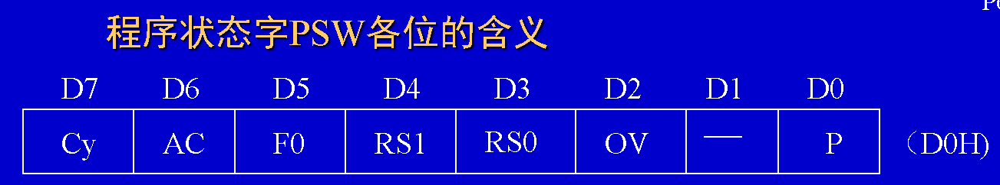

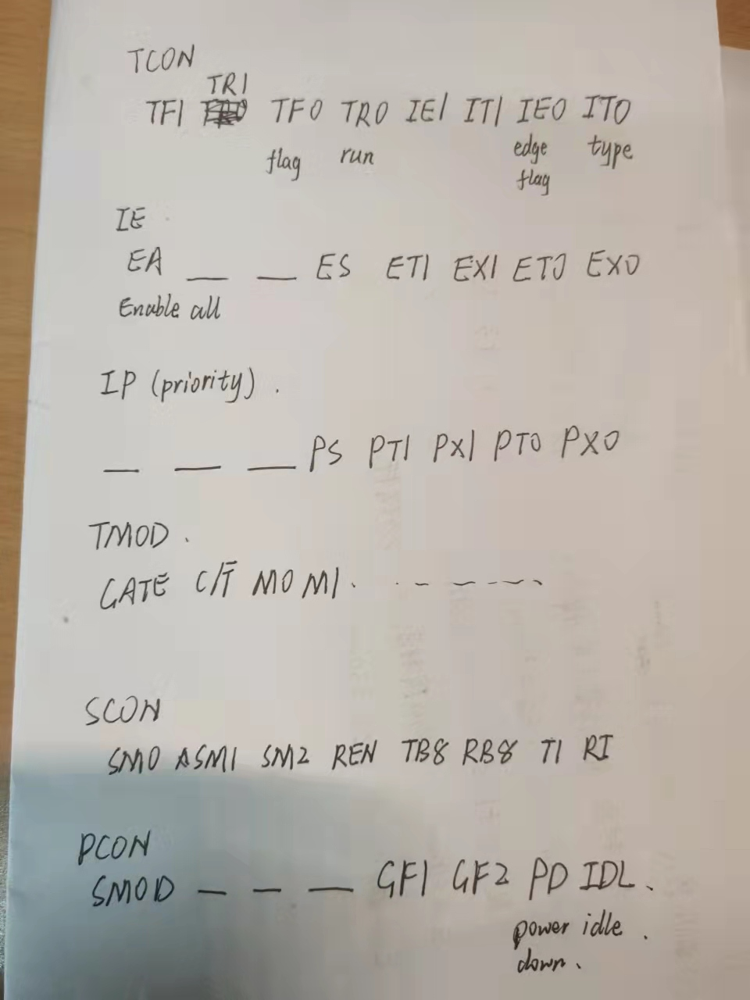

## mov instruction

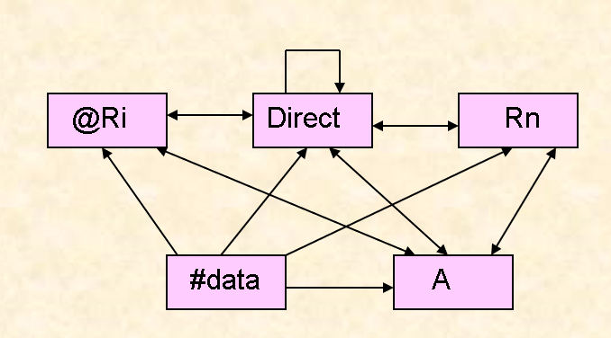

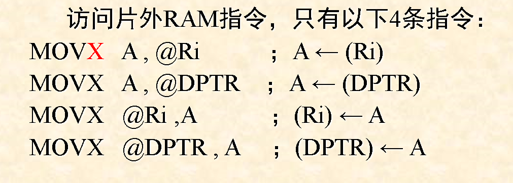

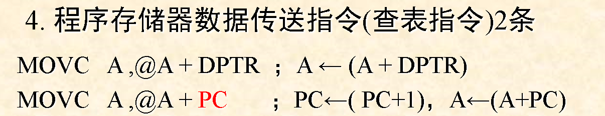

## exchange

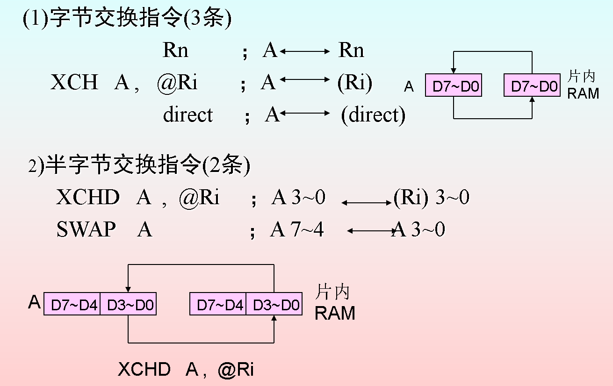

## stack

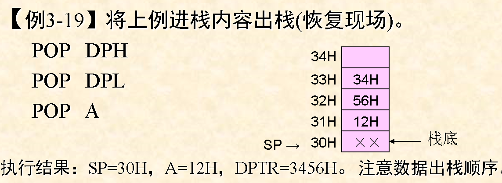

pop ACC

## acc

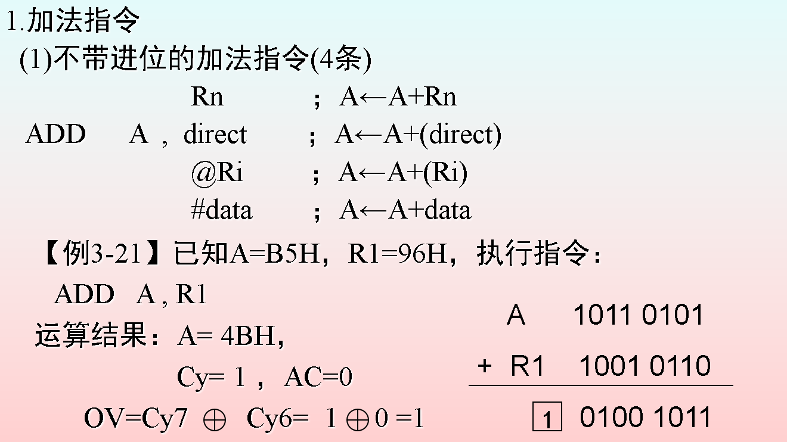

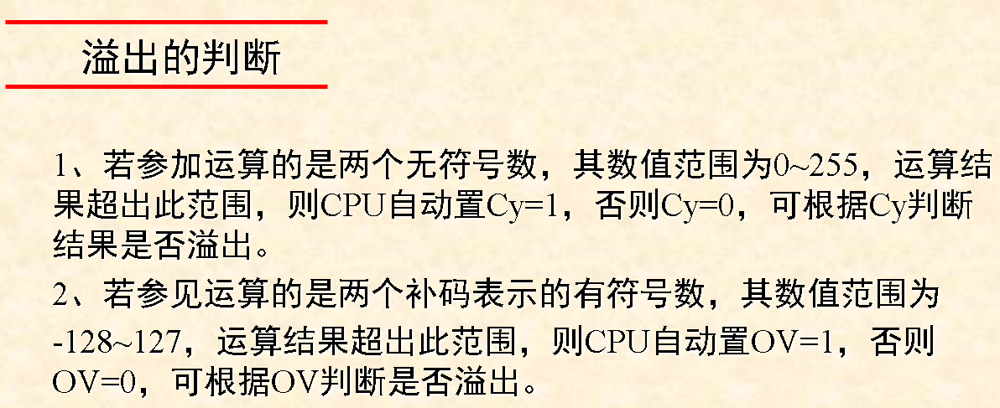

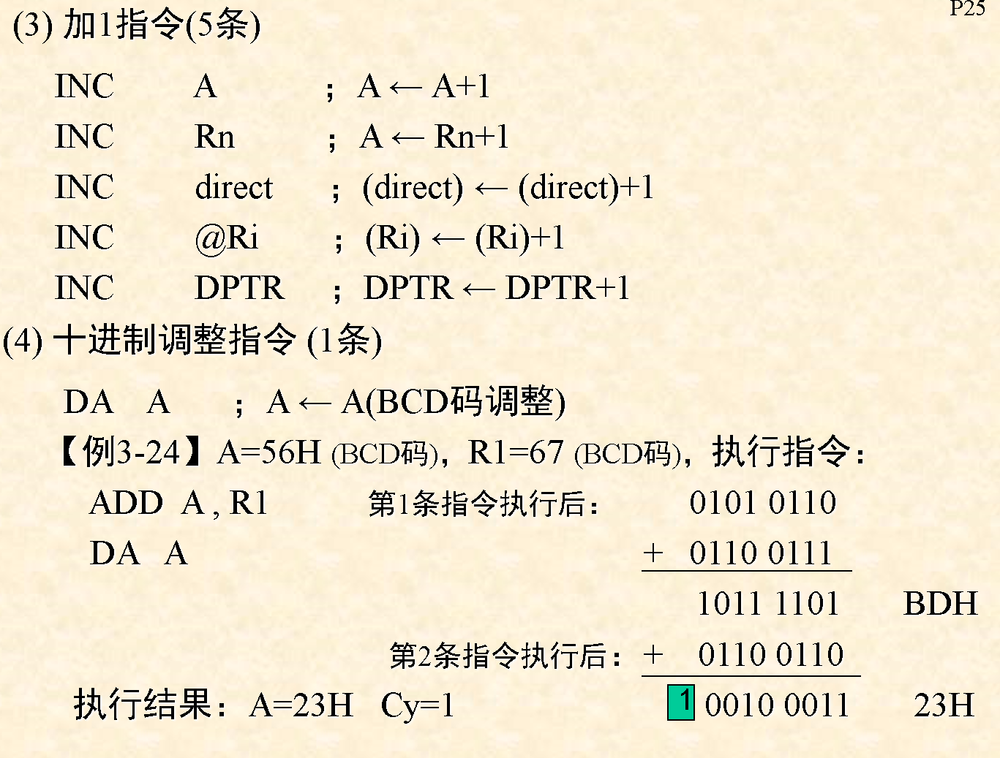

## sub

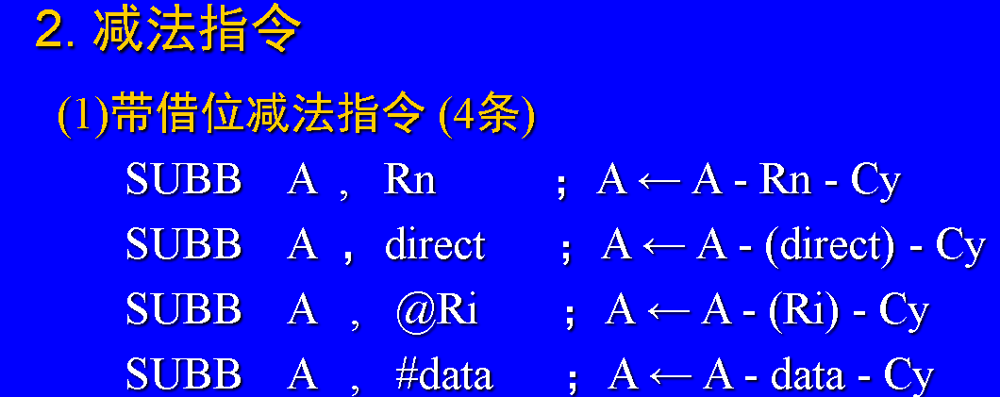

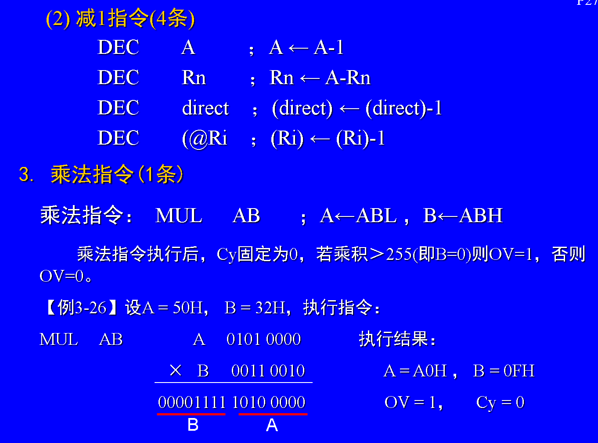

dec 不能对 dptr

mul cy = 0

## div

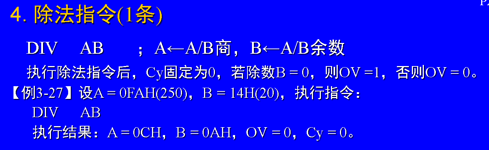

## jmp

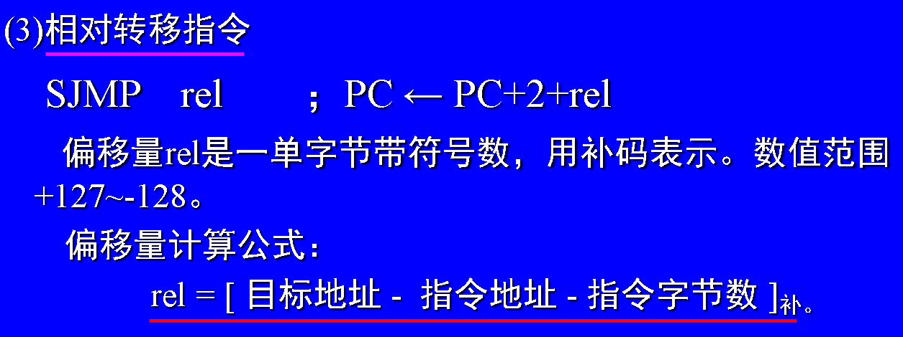

## return

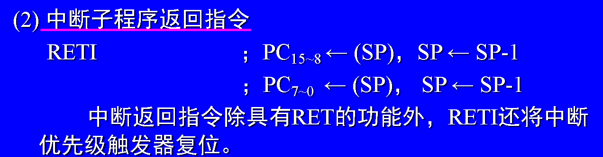

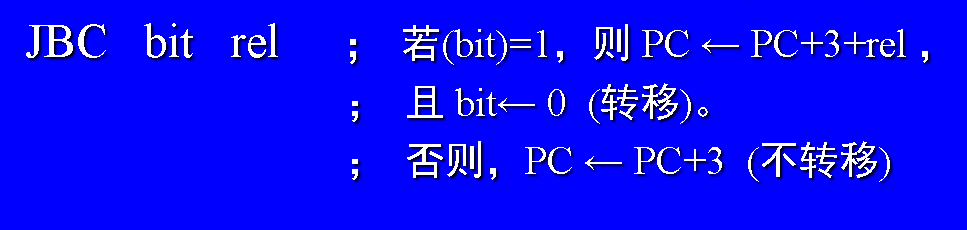

## hardware

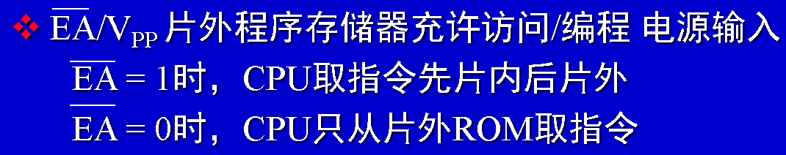

## interrupt

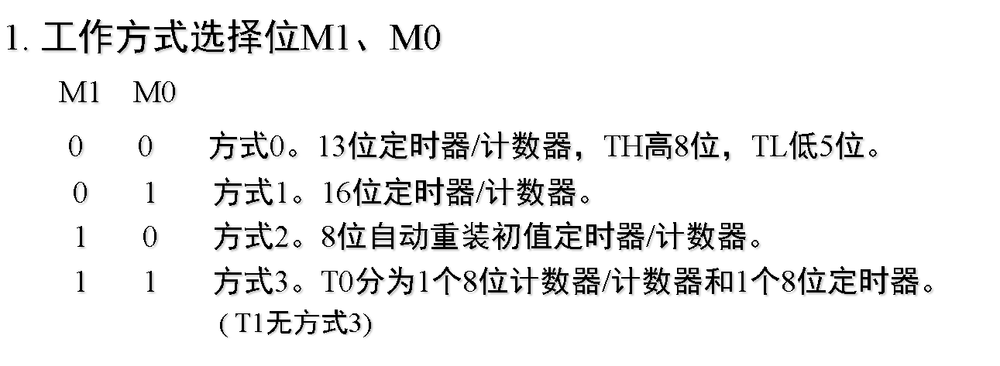

## serial port communication

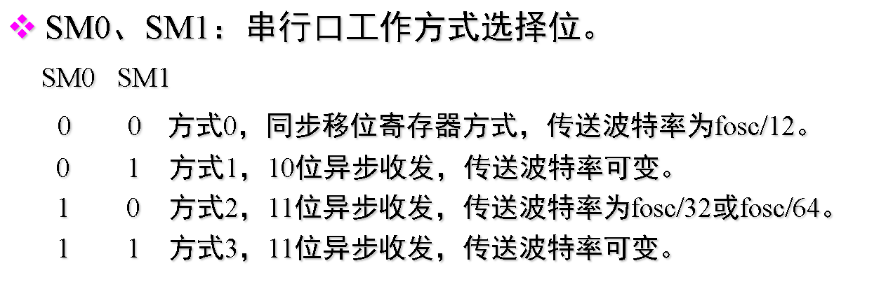
